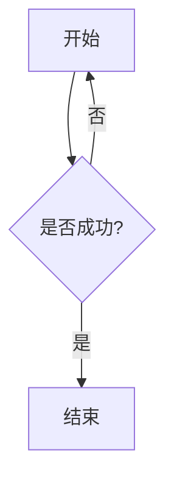
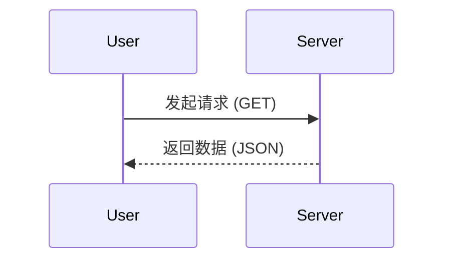
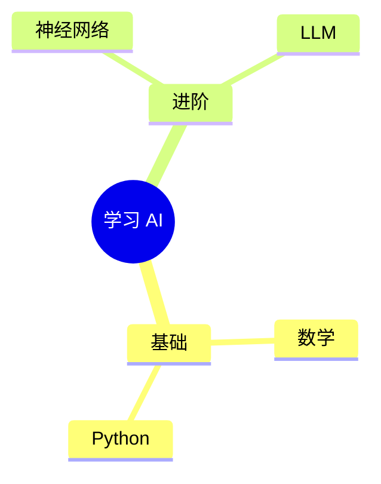

这份 Markdown 速查手册专为你在 **Hexo + GitHub Pages** 环境下的学习笔记与技术博客创作而设计。

---

## 📑 目录索引

1. [文字排版](https://www.google.com/search?q=%231-%E6%96%87%E5%AD%97%E6%8E%92%E7%89%88)
2. [列表](https://www.google.com/search?q=%232-%E5%88%97%E8%A1%A8)
3. [代码](https://www.google.com/search?q=%233-%E4%BB%A3%E7%A0%81)
4. [图片与链接](https://www.google.com/search?q=%234-%E5%9B%BE%E7%89%87%E4%B8%8E%E9%93%BE%E6%8E%A5)
5. [表格](https://www.google.com/search?q=%235-%E8%A1%A8%E6%A0%BC)
6. [Mermaid 流程图](https://www.google.com/search?q=%236-mermaid-%E6%B5%81%E7%A8%8B%E5%9B%BE)
7. [Hexo 特有语法](https://www.google.com/search?q=%237-hexo-%E7%89%B9%E6%9C%89%E8%AF%AD%E6%B3%95)
8. [排版技巧](https://www.google.com/search?q=%238-%E6%8E%92%E7%89%88%E6%8A%80%E5%B7%A7)
9. [🚀 速查索引卡](https://www.google.com/search?q=%239-%E9%80%9F%E6%9F%A5%E7%B4%A2%E5%BC%95%E5%8D%A1)

---

## 1. 文字排版

### 标题层级

```markdown
# 一级标题 (建议每篇文章仅一个，Hexo 默认作为文章名)
## 二级标题 (主要章节)
### 三级标题 (小节)
#### 四级标题 (更深层级)

```

### 文本格式

| 语法           | 效果说明                                         |
| -------------- | ------------------------------------------------ |
| `**加粗文本**` | **加粗文本**（强调重点）                         |
| `*斜体文本*`   | *斜体文本*（术语引用）                           |
| `~~删除线~~`   | ~~删除线~~（已过时内容）                         |
| `==高亮文本==` | ==高亮文本==（需主题支持，或使用 HTML `<mark>`） |

### 引用块

```markdown
> 这是一个单层引用
>> 这是一个嵌套引用（回复或深入解释）

```

### 分割线

```markdown
---
(上方需留空行，用于区分章节)

```

---

## 2. 列表

### 基础列表

```markdown
- 无序列表项 1
- 无序列表项 2

1. 有序列表第一项
2. 有序列表第二项

```

### 任务清单 (Todo)

```markdown
- [ ] 待完成任务
- [x] 已完成任务 (Hexo 渲染后可直接显示勾选框)

```

### 嵌套列表

*缩进两个空格即可：*

```markdown
- 编程语言
  - 静态语言
    1. Java
    2. C++

```

---

## 3. 代码

### 行内代码

使用 ``code`` 插入，例如：通过 `npm install hexo` 安装。

### 多行代码块 (带语言标注)

使用三个反引号，并在首行标注语言。

**Python 示例：**

```python
def hello_world():
    # 打印问候语
    print("Hello, Hexo!")

```

**Bash/Shell 示例：**

```bash
# 部署到 GitHub Pages
hexo clean && hexo g -d

```

**SQL 示例：**

```sql
SELECT * FROM users WHERE status = 'active'; -- 查询活跃用户

```

> **规范提示**：代码内注释应遵循该语言原生规范（如 Python 用 `#`，JS 用 `//`）。

---

## 4. 图片与链接

### 链接

```markdown
[点击访问百度](https://www.baidu.com)
<https://google.com> (自动转链接)

```

### 图片插入

```markdown


```

### Hexo 居中图片 (HTML 兼容)

Markdown 原生不支持居中，Hexo 环境建议使用 HTML：

```html
<div align="center">
  
  <p>图 1: 图片说明文字</p>
</div>

```

---

## 5. 表格

### 基础语法与对齐

```markdown
| 姓名   |    语言     |   熟练度 |
| :----- | :---------: | -------: |
| Weijun |   Python    |     🚀 高 |
| AI     | [SQL](链接) | `Native` |

```

*注：`:` 在左为左对齐，两边都有为居中，在右为右对齐。*

---

## 6. Mermaid 流程图

*注意：需在 Hexo 中安装 `hexo-filter-mermaid-diagrams` 插件或主题自带支持。*

### 流程图 (Flowchart)



### 时序图 (Sequence)



### 思维导图 (Mindmap)



---

## 7. Hexo 特有语法

### Front Matter 模板

新建文章时置于顶部：

```yaml
---
title: 我的学习笔记
date: 2026-03-06 10:00:00
tags: [AI, React]
categories: 笔记
cover: /images/cover.jpg
---

```

### 文章摘要截断

在希望首页截断的地方加入：

```markdown
这是首页可见的部分。
这是点击“阅读全文”才能看到的部分。

```

---

## 8. 排版技巧

* **强制换行**：在行尾输入两个空格再回车，或使用 `<br>`。
* **段落分隔**：两个段落之间必须留一个纯空行。
* **HTML 嵌入**：
* `<u>下划线</u>` -> <u>下划线</u>
* `<font color="red">红字</font>` -> <font color="red">红字</font>


---

## 9. 🚀 速查索引卡

| 效果名称     | 对应最简语法                |
| ------------ | --------------------------- |
| **标题**     | `# H1` / `## H2` / `### H3` |
| **加粗**     | `**内容**`                  |
| **代码块**   | ````js ... ````             |
| **行内代码** | ``code``                    |
| **链接**     | `[文字](URL)`               |
| **图片**     | ``             |
| **无序列表** | `- 项`                      |
| **有序列表** | `1. 项`                     |
| **任务框**   | `- [ ]` / `- [x]`           |
| **引用**     | `> 内容`                    |
| **分割线**   | `---`                       |
| **摘要截断** | ``                          |

---

> **⚠️ 环境兼容性备注：**
> 1. **GitHub Pages**：默认使用 kramdown 或 GFM 渲染，对 HTML 标签支持度较高。
> 2. **Mermaid**：如果预览时不显示图表，请检查 `_config.yml` 中是否开启了 Mermaid 渲染开关。
> 3. **图片路径**：在 Hexo 中，建议将图片放在 `source/images` 下，引用路径写为 `/images/xxx.png`。
> 
> 

您是否需要我为您针对 **Hexo 的特定主题（如 Next 或 Butterfly）** 补充一些高级的“标签插件（Tag Plugins）”语法？